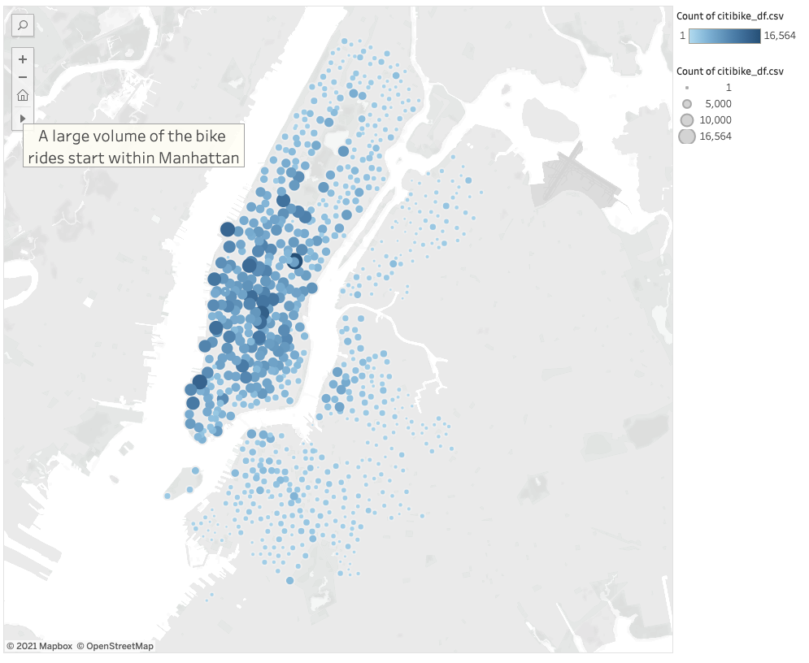
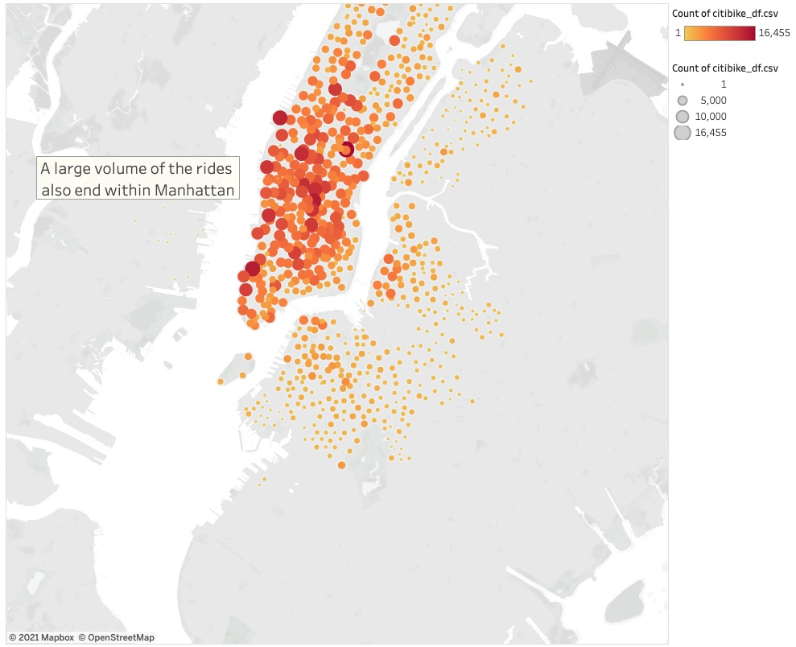
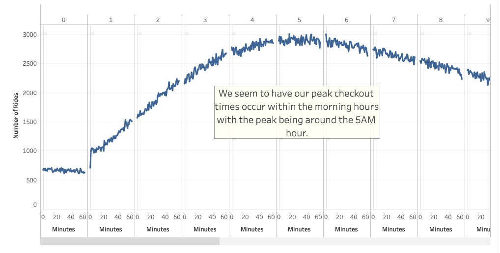
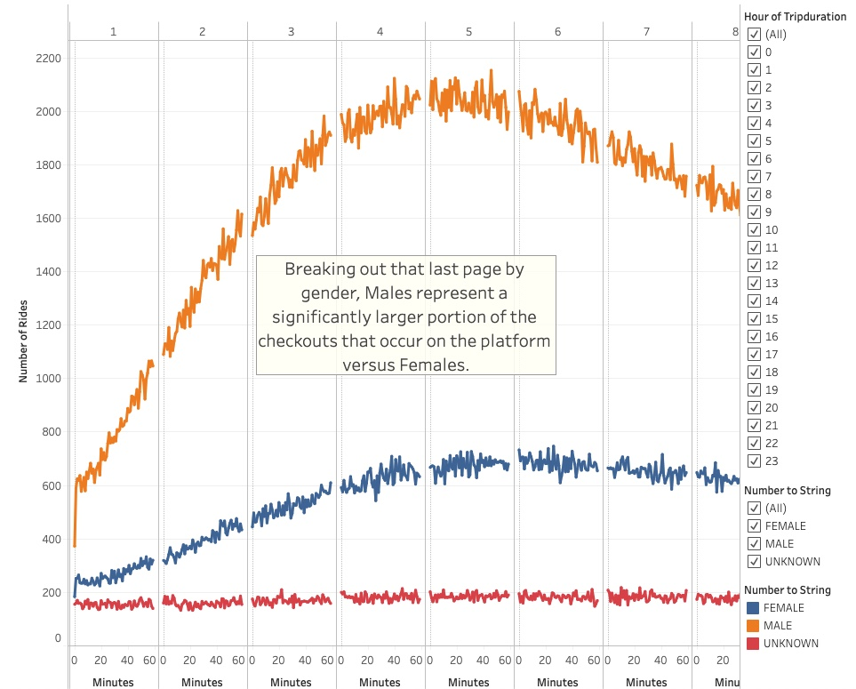
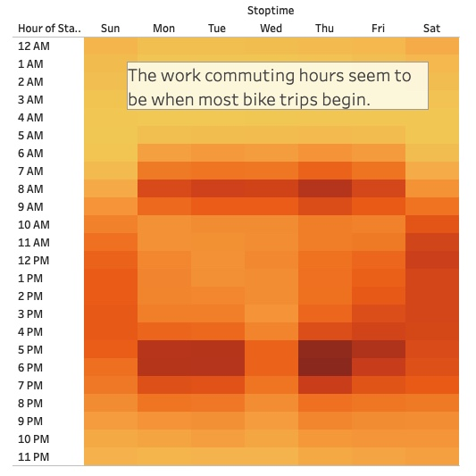
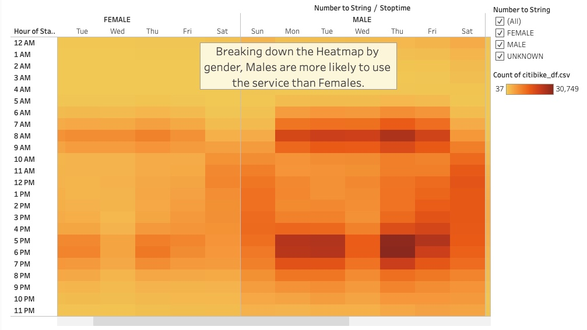
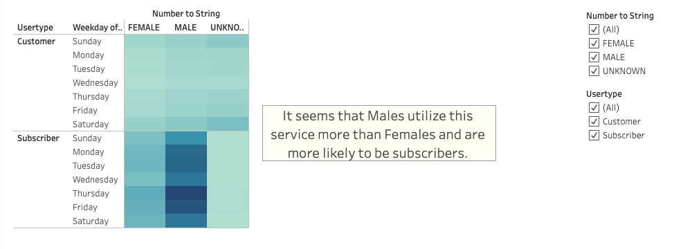

# Bikesharing

Link to Tableau Story:
[CitiBike Info](https://public.tableau.com/profile/jeff6307#!/vizhome/CitiBikeChallenge_16108481265540/CitiBikeChallenge?publish=yes "CitiBike Info")

## Project Overview

The purpose of this project is to lay out the argument that Des Moines IA should adopt a BikeSharing service within the city. We are using CitiBike information from New York during August of 2019 as a reference point of comparison to outline the benefits of having a service like this in Des Moines.

## Results

#### Ride Starting Location

As we see here with Manhattan, a lot of the rides start in a dense, downtown area. Activity like this can be seen about Des Moines around the various downtown and business districts.

#### Ride Ending Location

Like Manhattan, where the rides start, also has a concentration of ending about the same spot. Bikes don't seem to travel too far away from their origin point and can be more easily managed in a city like Des Moines

#### Checkout Time for Bikes

It seems that the primary purpose of these bikes is for commuting during the week, and tourism during the weekends.

#### Checkout Time for Bikes by Gender

When we slice that checkout time data by gender, we see that the distribution of bike rides logged are mostly by males. 

#### Number of Bike Trips by Weekday Heatmap

Here's another representation of what time of day and point in the week that rides start within Manhattan. We should expect activity like this to be similar to when we implement in Des Moines.

#### Number of Bike Trips by Weekday by Gender Heatmap

Again, we see a similar distribution between the genders about these points of pickup times.

#### User Trips by Gender by Weekday

In general, it seems that within Manhattan males use the service more than females throughout the week. There could be opportunity to promote our bike service to be more attractive to females as well!

## Summary

As we look at the images supplied, we see that having a bikeshare service in Manhattan is beneficial for both commuters and tourists alike. It seems that bikes remain relatively centralized about the city area which provides an alternative means of transportation about the city. This can get more cars off the road, locals and tourists better immersed in the community and better appreciation of the sites and sounds the Des Moines has to offer. There may be some concern about maintenance and the frequency and timing to implement said maintenance. We can show the frequency of use of each bike to determine when would be a reasonable time to get bikes checked in for service - we would also take user feedback as the bike is checked in to establish this point. Then, based on the rideship data, it seems that the late evening/super early morning hours would make for a good time to perform maintenance on these bikes. 

At any rate, based on the success of the bike share program demonstrated in Manhattan, we are confident that having bikeshare services in Des Moines is a great move and will bring more continuity to this thriving community. 
